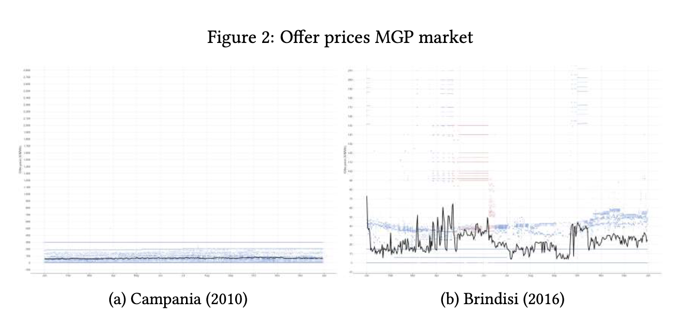

## Forthcoming

<a class="abstract-toggle" data-id="abs-1">Machine Learning for Detecting Collusion and Capacity Withholding in Wholesale Electricity Markets</a>

Forthcoming, <strong>with</strong> <a href="https://scholar.google.com/citations?user=c52V71kAAAAJ&hl=en">Martin Huber</a> and Jeremy Proz

Collusion and capacity withholding in electricity wholesale markets are important mechanisms of market manipulation. This study applies a refined machine learning–based cartel-detection algorithm to two cartel cases in the Italian electricity market and evaluates its out-of-sample performance. We propose novel screens capturing the capacity-withholding behavior of electricity providers and find that including such screens—derived from the day-ahead spot market rather than the balancing market—can improve cartel detection. Overall, the study provides a proof of concept for the strong potential of supervised machine learning techniques to detect and dismantle cartels in electricity markets.

<a href="files/paper_energy_compressed.pdf"><i class="bi bi-file-earmark-pdf"></i> PDF</a>
<a href="#"><i class="bi bi-easel2"></i> Slides</a>

<!-- 

 -->

<a class="abstract-toggle" data-id="abs-2">The Spatial Structure of Competitive Interactions: Evidence from Public Procurement Networks in Quebec</a>

Working Paper, <strong>with</strong> <a href="https://scholar.google.com/citations?user=cSCDeLEAAAAJ&hl=fr">Julie LeGallo</a> and <a href="https://scholar.google.fr/citations?user=UpPlMYwAAAAJ&hl=fr">Jean Dubé</a>

How do local markets form spatially? Using bid-level data from Quebec's municipal paving sector (2012–2019), we construct a geographical bidder overlap (GBO) index measuring supply-side substitutability between postal codes. Gravity-style regressions show that GBO decays with distance (elasticity ≈ −1) and increases with location similarity. Community detection on the GBO network identifies 47 functional market areas that diverge substantially from administrative boundaries. Exponential Random Graph models indicate that transitivity, geographic proximity, and agglomeration are each associated with market integration. The 47 functional market areas diverge substantially from administrative boundaries, suggesting that standard regional units are imperfect proxies for competitive geography in this sector.

<a href="files/paper_1.pdf"><i class="bi bi-file-earmark-pdf"></i> PDF</a>
<a href="#"><i class="bi bi-easel2"></i> Slides</a>

<!-- 

 -->

## Work in Progress

<a class="abstract-toggle" data-id="abs-3">Business as Usual: The Case of the Antitrust Inquiry in Quebec, Canada</a>

Job Market Paper

What are the dynamic effects of antitrust intervention? This paper examines the dynamic effects of antitrust intervention on bidding behavior in Quebec’s paving sector between 2011 and 2022. Using tender data, I analyze how antitrust intervention shapes competition across different levels of market aggregation. I implement a difference-in-differences with entropy balance weights to improve comparability between treated and untreated municipalities. I complement my study with a panel event design to trace the evolution of treatment effects over time. Although the estimates are imprecise due to structural features of the data, the results suggest that the impact of antitrust intervention was temporary rather than persistent, with limited long-run effects on public procurement outcomes. Nevertheless, the evidence points to a shift in the competitive landscape following the dismantling of the cartel.

<a href="files/JMP_v3.pdf"><i class="bi bi-file-earmark-pdf"></i> PDF</a>
<a href="files/paper2_slides_jdd_IMarin.pdf"><i class="bi bi-easel2"></i> Slides</a>
<!-- <a href="https://github.com/iamarin"><i class="bi bi-github"></i> Code</a> -->

<!-- 

 -->

